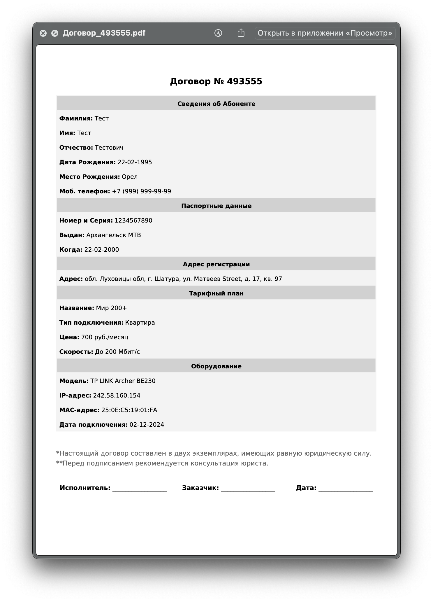
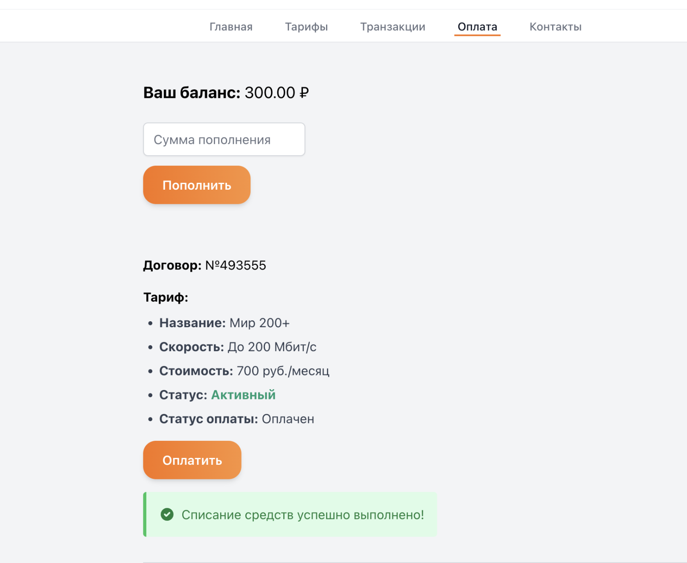
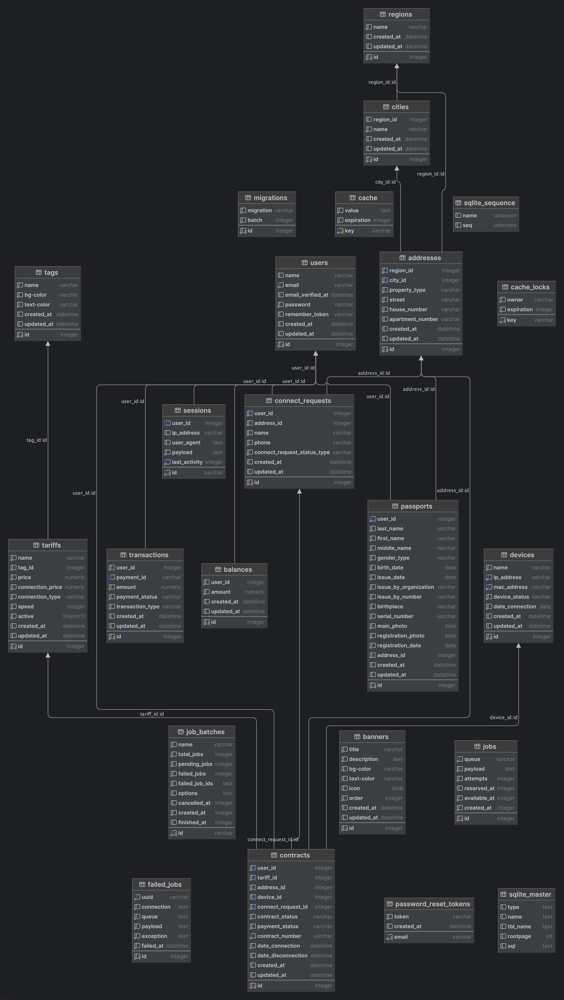

<p align="center"><a href="https://laravel.com" target="_blank"></a></p>

# Telecom – интернет провадйер.

## Команды для запуска проекта:
Требуется установка:
composer https://getcomposer.org
php8.2 https://windows.php.net/download
node.js: https://nodejs.org/en

<br>
Mac:

```
composer install
cp .env.example .env
php artisan key:generate
touch database/database.sqlite
php artisan migrate
php artisan storage:link
php artisan db:seed
npm install

npm run dev
php artisan serve
php artisan queue:work
```

Windows:
```
composer install
Copy-Item .env.example .env
php artisan key:generate
New-Item -Path database/database.sqlite -ItemType File
php artisan migrate
php artisan storage:link
php artisan db:seed
npm install

npm run dev
php artisan serve
php artisan queue:work
```
## Стэк проекта:

- `Laravel 11`
- `php-8.2`
- `Composer`
- `NPM`
- `Vite`
- `Blade`
- `Tailwind CSS v3.4.17`
- `Livewire / AlpineJS`
- `Filament admin panel`
- `SQLite`

---

## О проекте

Проект демонстрирует FullStack разработку интернет провайдера, в котором присутствует полный функционал
аутентификации,
для этого используется стандартный `Laravel Breeze` на `AlpineJS`. База данных проектировалась самостоятельно, изучая
интернет провайдер и до-проектировалась по ходу разработки.

Страницы заполняются данными через админ панель `Filament` (`http://127.0.0.1:8000/admin`) или частично с помощью
`Seeders / Factory`
После авторизации, клиент может воспользоваться услугой заказать подключение интернета и выбрать тариф, который делится
на Частный сектор и Многоквартирный дом.
Но для совершения заказа услуги, необходимо заполнить паспорт в профиле.
После чего можно совершить заказ услуги, запись попадает в таблицу `connect_requests` и на его основе автоматически
создается договор в таблице `contracts`, с индивидуальным номером и со статусом 'Ожидает Активации' (Предполагается что
администратор сам изменит статус договора после подключения необходимого оборудования).

Договор имеет несколько статусов, он регулируется в `admin panel`. Изначально у клиента есть баланс на аккаунте, который
он может пополнять, но оплатить интернет сможет только при статусе договора 'Активный', также можно скачать полный
договор в PDF файле (используется `DomPDF`).
Вся информация о действиях пользователя относительно заявлений и договоров находится в 'Общая информация'.

Оплата реализована с помощью Yookassa (`PaymentServices`, webhook настроен на `ngrok`,
пример:  `https://link/api/payments/webhook`, креды в `.env`). Каждый договор оплачивается отдельно, по истечению 10 секунд, можно
оплатить снова, при этом статус оплаты изменится на 'Не оплачен'. Для этой реализации использовался `Job` (
`UpdateContractPaymentStatus`).
Вся информация о транзакциях пользователя содержится в 'Транзакции'. Для примера добавлен к `Contract` политика `Gate`,
который определяет, может ли пользователь просматривать договор.

---

**Admin Panel содержит:**

- Баннеры
- Города
- Регионы
- Клиенты
- Заявления на подключения интернета
- Договоры клиентов
- Устройства (роутеры) клиентов
- Тарифы

---

**Страницы сайта:**

- Главная
- Личная информация
- Профиль
- Тарифы
- Общая информация (доступна при наличии заполненного паспорта в профиле)
- Транзакции
- Оплата
- Контакты

---

**Controllers:**

- `BaseInfoController` – отвечает за информацию заявлений и договоров (тариф, роутер).
- `MainController` – главная страница сайта.
- `PassportController` – управляет созданием и редактированием паспортных данных.
- `PaymentController` – отвечает за пополнение, списание средств.
- `PDFController` – позволяет скачать договор в PDF.
- `ProfileController` – отвечает за редактирование профиля клиента.
- `TariffController` – отображает список тарифов.
- `TransactionController` – отображает историю транзакций клиента, как общую, так и конкретно по договору.
- `ContactController` – отображает контакты.

---

**Enums:**

- `ConnectRequestStatus` – статус заявления на подключения интернета.
- `ContractStatus` – статус договора.
- `DeviceStatusType` – статус устройства (роутера).
- `Gender` – пол.
- `MonthlyPaymentStatus` – статус оплаты за месяц (Оплачен / Не оплачен).
- `PaymentStatus` – статус платежа Yookassa в таблице 'Транзакции'.
- `PropertyType` – тип жилья.
- `TransactionType` – тип транзакции (Пополнение / Списание).

---

**Exceptions class:**

- `PaymentCreationExceptionHandler` – класс для обработки исключений при создании платежа.
- `PaymentExceptionHandler` – класс для обработки исключений при платеже.
- `PaymentWithdrawExceptionHandler` – класс для обработки исключений при списании.

---

**Auth Controllers:**

- `AuthenticatedSessionController` – отвечает за вход пользователя в систему (логин) и управление сессией.
- `ConfirmablePasswordController` – управляет подтверждением пароля пользователя.
- `EmailVerificationNotificationController` – отправляет уведомления для верификации email.
- `EmailVerificationPromptController` – отображает запрос на верификацию email.
- `NewPasswordController` – обрабатывает создание нового пароля при сбросе.
- `PasswordController` – управляет обновлением текущего пароля пользователя.
- `PasswordResetLinkController` – генерирует и отправляет ссылку для сброса пароля.
- `RegisteredUserController` – регистрирует нового пользователя в системе.
- `VerifyEmailController` – обрабатывает процесс верификации email по полученной ссылке.

---

**Requests class:**

- `LoginRequest` - валидация логина (email, password).
- `StorePassportRequest` - валидация паспортных данных из формы создания.
- `UpdatePassportRequest` - валидация паспортных данных из формы редактирования.
- `CreatePaymentRequest` - валидация оплаты.
- `ProfileUpdateRequest` - валидация обновления профиля пользователя.

---

**Jobs:**

- `UpdateContractPaymentStatus` – изменяет статус контракта на `UNPAID`.

---

**Livewire class:**

- `AddressSelector` – форма места жительства.
- `ContractExpandableSection` – расширяющаяся секции договора с информацией.
- `ContractTransactionExpandableSection` – расширяющаяся секции договора с информацией о транзакциях.
- `UserTransactionExpandableSection` – расширяющаяся секции с информацией о транзакциях клиента.
- `TariffModal` – модальное окно для смены тарифа в 'Общая информация'.
- `OrderModal` – модальное окно для заказа услуги подключения интернета.
- `SuccessModal` – модальное окно с сообщением об успехе.
- `PassportModal` – модальное окно (заполните паспорт).

---

**Policies:**

- `ContractPolicy` – политика, которая проверяет, может ли пользователь просматривать договор.

---

**Services:**

- `PaymentService` – сервис, который содержит бизнес логику оплаты и списания денежных средств.
- Тестовая карта для `Yookassa`: 5555 5555 5555 4444

---

**Seeders / Factory:**

- `UserSeeder | UserFactory` – создает пользователя admin и других дополнительных через фабрику, также создается таблица
  balance для каждого.
- `RegionCitySeeder | (RegionFactory / CityFactory)` – создает регионы и города через фабрику, Каждый город
  привязывается к региону.
- `AddressSeeder | AddressFactory` – создаются адреса через фабрику.
- `TagSeeder` – создает тэги для тарифов.
- `TariffSeeder` – создает 3 тестовых тарифа.
- `BannerSeeder` – создает 3 тестовых баннера.
- `DeviceSeeder | DeviceFactory` – создает устройства (маршрутизаторы) на основе списка через фабрику.
- `ConnectRequestSeeder | ConnectRequestFactory` – создает тестовое заявление для пользователя admin.
- `ContractSeeder` – создает договор для пользователя admin.
- Для паспорта не создавал сид, его необходимо заполнить вручную.

---

**WEB Routers:**

- `/` – отображает главный экран.
- `/tariffs` – отображает доступные тарифы.
- `/profile` – отображает профиль клиента, позволяет обновить пользовательские данные и пароль.
- `/base-info` – отображает информацию об заявлениях и договоров клиента.
- `/passport` – ресурс, который позволяет создать, редактировать и отображать паспорт.
- `/pdf/{id}` – по id договора позволяет сгенерировать договор в PDF формате.
- `/payments` – отображает текущий баланс, и платежную информацию о договорах, позволяет оплатить договоры или пополнить
  баланс.
- `/payments/callback` – используется обработки обратных вызовов от платежной системы.
- `/withdraw/{contract}` – используется для выполнения операции списания средств по конкретному договору.
- `/transaction` – отображает историю транзакций.
- `/contact` – отображает информацию про контакты.

**Auth routers:**

- `/register` – отображает форму регистрации (GET) и обрабатывает создание нового пользователя (POST).
- `/login` – отображает форму входа (GET) и выполняет авторизацию пользователя (POST).
- `/forgot-password` – отображает форму для запроса сброса пароля (GET) и отправляет ссылку для сброса (POST).
- `/reset-password/{token}` – отображает форму для ввода нового пароля с использованием токена (GET).
- `/reset-password'` – обрабатывает сохранение нового пароля (POST).
- `/verify-email` – отображает страницу с запросом подтверждения email.
- `/verify-email/{id}/{hash}` – подтверждает email по уникальной ссылке с ID и хэшем
- `/email/verification-notification` – отправляет уведомление для повторной верификации email (POST).
- `/confirm-password` – отображает форму подтверждения пароля (GET) и проверяет его (POST).
- `/password` – обновляет пароль пользователя (PUT).
- `/logout` – выполняет выход пользователя из системы (POST).

---

**API routers:**

- `/payments/webhook` – обрабатывает POST-запросы из Yookassa.

---

## Скриншоты

### Главный экран


### Тарифы


### Тарифы / Модальное окно


### Общая Информация / Заявления


### Общая Информация / Договоры


### Договоры / PDF



### Оплата / Пополнение


### Оплата / Списание



### Транзакции


### Профиль


### Профиль / Паспорт


### Filament Admin Panel


### Схема базы данных




